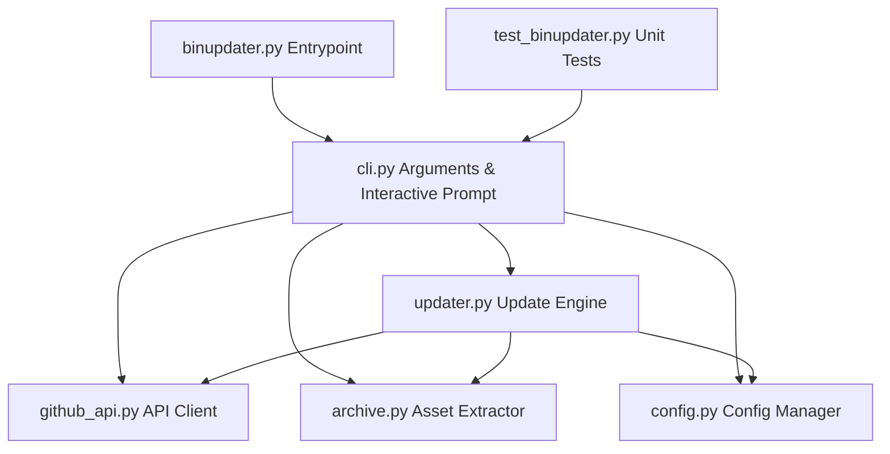

# Design Spec: binupdater.py Decomposition / Modularization

**Date:** 2026-06-05  
**Topic:** Splitting monolithic `binupdater.py` into cohesive modules  
**Status:** Approved  

---

## 1. Overview
The `binupdater` utility has grown to over 860 lines in a single file (`binupdater.py`). This monolithic structure leads to high token consumption when working with agentic systems, as the entire file must be loaded for any reading or editing.
To optimize token usage and follow best practice software architecture, we are splitting the monolithic file into six cohesive, flat modules, each with a single responsibility.

---

## 2. Directory & Module Architecture

All files will be structured in a flat pattern directly in the root directory:

---

## 3. Module Specifications

### A. `config.py`
- **Responsibility**: Manages tool configuration (`config.toml`) and environment platform detection.
- **Exports**: `DEFAULT_VERSION_REGEX`, `get_config_path()`, `load_config()`, `save_config()`, `get_platform()`.

### B. `github_api.py`
- **Responsibility**: Wrapper over the GitHub REST API and raw binary asset streaming.
- **Exports**: `GITHUB_API`, `get_repo_description()`, `get_latest_release()`, `download_file()`.

### C. `archive.py`
- **Responsibility**: Identifies, lists, and extracts files from zip or tar archives.
- **Exports**: `is_archive()`, `list_archive()`, `find_in_archive()`, `extract_file()`.

### D. `updater.py`
- **Responsibility**: Version comparison, binary replacement engine, and checked tool pipeline.
- **Exports**: `UpdateResult`, `replace_binary()`, `detect_version()`, `run_version_cmd()`, `extract_version()`, `version_newer()`, `normalize_version()`, `check_tool()`, `update_tool()`.

### E. `cli.py`
- **Responsibility**: All user prompt interactions (including the newly added range selection logic) and command-line execution routing (`add`, `update`, `list`, `remove`).
- **Exports**: `_choose_multi()`, `cmd_add()`, `cmd_update()`, `cmd_list()`, `cmd_remove()`.

### F. `binupdater.py`
- **Responsibility**: Lightweight entrypoint wrapper that instantiates CLI argument parsing.

---

## 4. Test Alignment
The unit tests in `test_binupdater.py` currently test prompt validation from `binupdater.py`. They will be redirected to import `_choose_multi` directly from `cli.py`.
